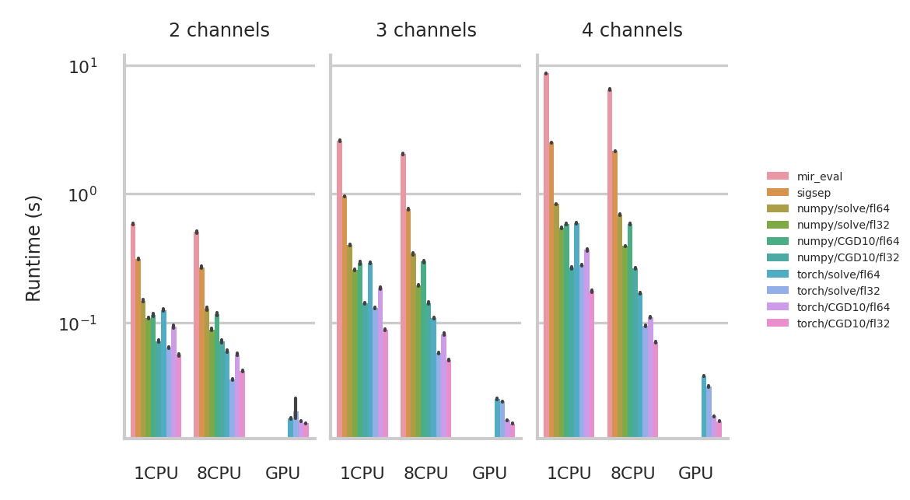

fast\_bss\_eval
==============

[](https://badge.fury.io/py/fast-bss-eval)
[](https://fast-bss-eval.readthedocs.io/en/latest/?badge=latest)
[](https://github.com/fakufaku/fast_bss_eval/actions/workflows/lint.yml)
[](https://github.com/fakufaku/fast_bss_eval/actions/workflows/pythonpackage.yml)
[](https://codecov.io/gh/fakufaku/fast_bss_eval)

> Do you have a zillion BSS audio files to process and it is taking days ?
> Is your simulation never ending ?
>
> Fear no more! `fast_bss_eval` is here to help **you!**

`fast_bss_eval` is a fast implementation of the bss\_eval metrics for the
evaluation of blind source separation.  Our implementation of the bss\_eval
metrics has the following advantages compared to other existing ones.

* seamlessly works with **both** [numpy](https://numpy.org/) arrays and [pytorch](https://pytorch.org) tensors
* very fast
* can be even faster by using an iterative solver (add `use_cg_iter=10` option to the function call)
* differentiable via pytorch
* can run on GPU via pytorch

Author
------

* [Robin Scheibler](robin.scheibler@linecorp.com)

Quick Start
-----------

### Install

```bash
# from pypi
pip install fast-bss-eval

# or from source
git clone https://github.com/fakufaku/fast_bss_eval
cd fast_bss_eval
pip install -e .
```

### Use

Assuming you have multichannel signals for the estmated and reference sources
stored in wav format files names ``my_estimate_file.wav`` and
``my_reference_file.wav``, respectively, you can quickly evaluate the bss_eval
metrics as follows.


```python
from scipy.io import wavfile
import fast_bss_eval

# open the files, we assume the sampling rate is known
# to be the same
fs, ref = wavfile.read("my_reference_file.wav")
_, est = wavfile.read("my_estimate_file.wav")

# compute the metrics
sdr, sir, sar, perm = fast_bss_eval.bss_eval_sources(ref.T, est.T)
```

Benchmark
---------

This package is significantly faster than other packages that also allow
to compute bss\_eval metrics such as [mir\_eval](https://github.com/craffel/mir_eval) or [sigsep/bsseval](https://github.com/sigsep/bsseval).
We did a benchmark using numpy/torch, single/double precision floating point
arithmetic (fp32/fp64), and using either Gaussian elimination or a [conjugate
gradient descent](https://en.wikipedia.org/wiki/Conjugate_gradient_method)
(solve/CGD10).




Citation
--------

If you use this package in your own research, please cite [our paper](https://arxiv.org/abs/2110.06440) describing it.

```bibtex
@misc{scheibler_sdr_2021,
  title={SDR --- Medium Rare with Fast Computations},
  author={Robin Scheibler},
  year={2021},
  eprint={2110.06440},
  archivePrefix={arXiv},
  primaryClass={eess.AS}
}
```


License
-------

2021 (c) Robin Scheibler, LINE Corporation

All of this code is released under [MIT License](https://opensource.org/licenses/MIT) with the exception of `fast_bss_eval/torch/hungarian.py` which is under [3-clause BSD License](https://opensource.org/licenses/BSD-3-Clause).
